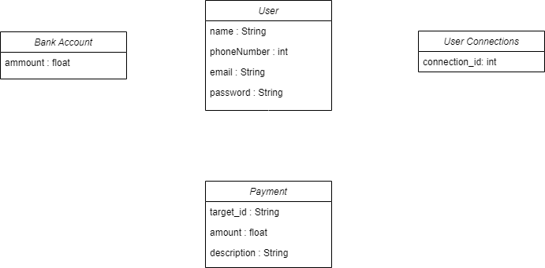
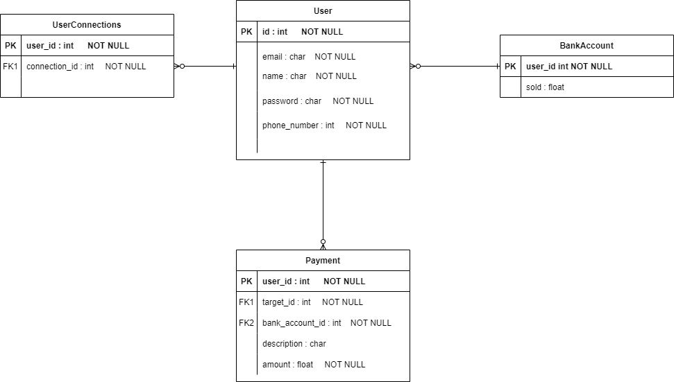

# P6_PayMyBuddyBackend
Projet 6 Openclassrooms : Application de transfert d'argent

Application Spring Boot 2.7.3

## Fonctionnalités

- Créer un compte
- S'identifier dans l'application à l'aide d'une adresse email
- Ajouter une connection (un autre utilisateur déjà existant en base de données)
- Envoyer de l'argent à une connection

## UML

## MPD

