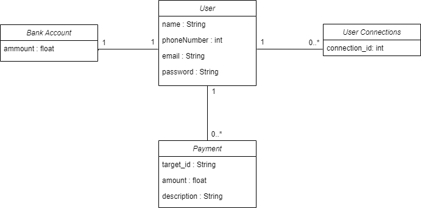

# P6_PayMyBuddyBackend
Projet 6 Openclassrooms : Application de transfert d'argent

## Fonctionnalités

- Créer un compte
- S'identifier
- Ajouter une connection
- Envoyer de l'argent à une connection

## UML

## MPD

